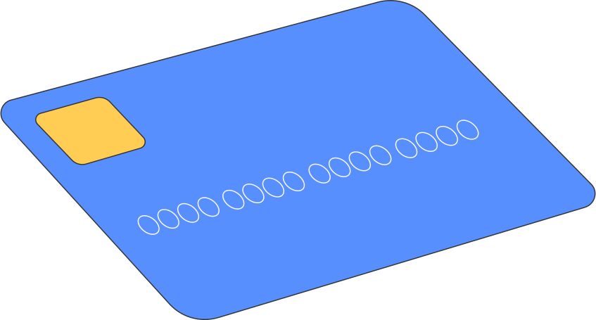
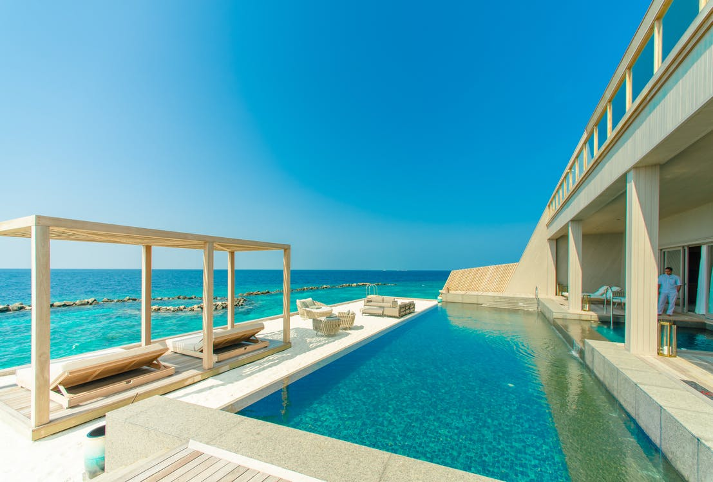

# 🎯 CPJ-HP レスポンシブ化 完全実装ガイド

## 📊 プロジェクト概要

```
プロジェクト名: CPJ-HP レスポンシブ対応
現状: デスクトップ特化（1440px以上）
目標: 全デバイス対応（320px〜）
期間: 10-14営業日（フルタイム想定）
難易度: ★★★★☆（中〜高）
```

### 修正箇所サマリー
```
固定px値: 237箇所
レスポンシブクラス: 0箇所 → 600+箇所
JavaScript調整: 5ファイル相当
新規HTML: ハンバーガーメニュー等 80行
```

---

## 🗺️ ブレークポイント設計

```css
/* デバイス別ブレークポイント */
Mobile-S:  320px - 374px  /* iPhone SE等 */
Mobile-M:  375px - 424px  /* iPhone 12/13 */
Mobile-L:  425px - 767px  /* iPhone Pro Max */
Tablet:    768px - 1023px /* iPad */
Desktop:   1024px - 1439px /* ノートPC */
Wide:      1440px+        /* デスクトップ（既存デザイン維持）*/

/* Tailwind対応 */
ベース:    〜767px
sm:       768px
md:       1024px
lg:       1280px
xl:       1440px
```

---

## 📋 10フェーズ実装計画

---

### **Phase 0: 環境セットアップ**（0.5日）

#### 作業内容
1. **Gitブランチ作成**
```bash
cd /Users/kousaiyamamoto/CPJ:HP
git checkout -b feature/responsive-design
git push -u origin feature/responsive-design
```

2. **バックアップ作成**
```bash
cp index.html index.html.backup
```

3. **開発環境確認**
```bash
# Live Serverなど確認
open -a "Google Chrome" index.html
```

4. **修正箇所リスト作成**（スプレッドシート推奨）
```
セクション名 | 現在のクラス | 修正後のクラス | 優先度
Navigation | px-[100px] | px-4 lg:px-20 xl:px-[100px] | 高
Hero Title | text-[66px] | text-3xl md:text-5xl xl:text-[66px] | 高
```

#### 成果物
- ✅ 作業ブランチ
- ✅ バックアップファイル
- ✅ 修正箇所リスト

---

### **Phase 1: ナビゲーション完全実装**（2日）

#### 1.1 デスクトップナビ調整（4時間）

**修正箇所: index.html:202-216**

```html
<!-- BEFORE -->
<nav class="nav-bar relative z-10 flex items-center justify-between px-[100px] py-[25px] gap-8">
    <div class="w-[320px] h-[90px] flex-shrink-0">
        
    </div>
    <div class="flex items-center gap-8 flex-1 justify-center">
        <a href="#service" class="text-white text-[15px]">サービスの魅力</a>
        <!-- 他のリンク -->
    </div>
    <a href="https://lin.ee/aF6snAh" class="bg-[#93288e] text-white px-8 py-3.5 text-[14px]">
        無料相談する
    </a>
</nav>

<!-- AFTER -->
<nav class="nav-bar relative z-10 flex items-center justify-between px-4 sm:px-6 md:px-10 lg:px-16 xl:px-[100px] py-4 sm:py-5 md:py-[25px] gap-4 md:gap-6 lg:gap-8">
    <!-- ロゴ：モバイルで縮小 -->
    <div class="w-40 h-12 sm:w-48 sm:h-14 md:w-56 md:h-16 lg:w-[280px] lg:h-[80px] xl:w-[320px] xl:h-[90px] flex-shrink-0">
        
    </div>

    <!-- デスクトップメニュー -->
    <div class="hidden lg:flex items-center gap-6 xl:gap-8 flex-1 justify-center">
        <a href="#service" class="border-b-2 border-white/80 px-2 py-2 text-white text-sm xl:text-[15px] font-medium tracking-wide whitespace-nowrap hover:opacity-80 transition-opacity">サービスの魅力</a>
        <a href="#destinations" class="text-white text-sm xl:text-[15px] font-light tracking-wide hover:opacity-80 transition-opacity whitespace-nowrap">世界各地の寄港地</a>
        <a href="#reviews" class="text-white text-sm xl:text-[15px] font-light tracking-wide hover:opacity-80 transition-opacity whitespace-nowrap">会員の声</a>
        <a href="#consultation" class="text-white text-sm xl:text-[15px] font-light tracking-wide hover:opacity-80 transition-opacity whitespace-nowrap">無料相談</a>
        <a href="#business" class="text-white text-sm xl:text-[15px] font-light tracking-wide hover:opacity-80 transition-opacity whitespace-nowrap">ビジネスについて</a>
    </div>

    <!-- デスクトップCTAボタン -->
    <a href="https://lin.ee/aF6snAh" target="_blank" rel="noopener noreferrer" class="hidden lg:inline-block btn-hover bg-[#93288e] text-white px-6 xl:px-8 py-3 xl:py-3.5 rounded-sm font-medium text-sm xl:text-[14px] tracking-wide hover:bg-[#7a2075] transition-all whitespace-nowrap flex-shrink-0 text-center">
        無料相談する
    </a>

    <!-- ハンバーガーボタン（モバイル・タブレット） -->
    <button id="mobile-menu-btn" class="lg:hidden z-50 bg-[#93288e] p-2.5 rounded hover:bg-[#7a2075] transition-colors" aria-label="メニューを開く">
        <svg class="w-6 h-6 text-white" fill="none" stroke="currentColor" viewBox="0 0 24 24" xmlns="http://www.w3.org/2000/svg">
            <path stroke-linecap="round" stroke-linejoin="round" stroke-width="2" d="M4 6h16M4 12h16m-16 6h16"></path>
        </svg>
    </button>
</nav>
```

#### 1.2 モバイルメニュー実装（6時間）

**追加箇所: index.html:227（Heroセクションの直後）**

```html
<!-- モバイルメニュー -->
<div id="mobile-menu" class="fixed inset-0 bg-white transform translate-x-full transition-transform duration-300 ease-in-out z-[100] lg:hidden overflow-y-auto">
    <!-- 閉じるボタン -->
    <button id="mobile-menu-close" class="absolute top-6 right-4 bg-[#93288e] p-2.5 rounded hover:bg-[#7a2075] transition-colors" aria-label="メニューを閉じる">
        <svg class="w-6 h-6 text-white" fill="none" stroke="currentColor" viewBox="0 0 24 24">
            <path stroke-linecap="round" stroke-linejoin="round" stroke-width="2" d="M6 18L18 6M6 6l12 12"></path>
        </svg>
    </button>

    <!-- ロゴ -->
    <div class="px-6 pt-6 pb-4 border-b border-gray-200">
        
    </div>

    <!-- メニューリスト -->
    <nav class="flex flex-col p-6">
        <a href="#service" class="mobile-menu-link py-4 text-[#93288e] text-lg font-medium border-b border-gray-100 hover:bg-gray-50 transition-colors">
            サービスの魅力
        </a>
        <a href="#destinations" class="mobile-menu-link py-4 text-[#93288e] text-lg border-b border-gray-100 hover:bg-gray-50 transition-colors">
            世界各地の寄港地
        </a>
        <a href="#reviews" class="mobile-menu-link py-4 text-[#93288e] text-lg border-b border-gray-100 hover:bg-gray-50 transition-colors">
            会員の声
        </a>
        <a href="#consultation" class="mobile-menu-link py-4 text-[#93288e] text-lg border-b border-gray-100 hover:bg-gray-50 transition-colors">
            無料相談
        </a>
        <a href="#business" class="mobile-menu-link py-4 text-[#93288e] text-lg border-b border-gray-100 hover:bg-gray-50 transition-colors">
            ビジネスについて
        </a>

        <!-- CTAボタン -->
        <a href="https://lin.ee/aF6snAh" target="_blank" rel="noopener noreferrer" class="mt-6 bg-[#93288e] text-white text-center py-4 rounded-lg font-medium hover:bg-[#7a2075] transition-colors">
            無料相談する
        </a>
    </nav>
</div>
```

#### 1.3 JavaScript実装（4時間）

**追加箇所: index.html:1180（</script>の前）**

```javascript
// ===== モバイルメニュー =====
(function() {
    const mobileMenuBtn = document.getElementById('mobile-menu-btn');
    const mobileMenu = document.getElementById('mobile-menu');
    const mobileMenuClose = document.getElementById('mobile-menu-close');
    const mobileMenuLinks = document.querySelectorAll('.mobile-menu-link');

    // メニューを開く
    function openMenu() {
        mobileMenu.classList.remove('translate-x-full');
        document.body.style.overflow = 'hidden'; // スクロール防止
        mobileMenuBtn.setAttribute('aria-expanded', 'true');
    }

    // メニューを閉じる
    function closeMenu() {
        mobileMenu.classList.add('translate-x-full');
        document.body.style.overflow = ''; // スクロール復元
        mobileMenuBtn.setAttribute('aria-expanded', 'false');
    }

    // イベントリスナー
    mobileMenuBtn.addEventListener('click', openMenu);
    mobileMenuClose.addEventListener('click', closeMenu);

    // メニューリンククリックで閉じる
    mobileMenuLinks.forEach(link => {
        link.addEventListener('click', () => {
            setTimeout(closeMenu, 300); // スムーズスクロール後に閉じる
        });
    });

    // ESCキーで閉じる
    document.addEventListener('keydown', (e) => {
        if (e.key === 'Escape' && !mobileMenu.classList.contains('translate-x-full')) {
            closeMenu();
        }
    });

    // 画面外タップで閉じる
    mobileMenu.addEventListener('click', (e) => {
        if (e.target === mobileMenu) {
            closeMenu();
        }
    });
})();
```

#### テスト項目
- [ ] デスクトップ（1440px）でメニュー表示
- [ ] タブレット（768px）でハンバーガー表示
- [ ] モバイル（375px）でハンバーガー表示
- [ ] メニュー開閉アニメーション
- [ ] リンククリックでスムーズスクロール + メニュー閉じる
- [ ] ESCキーでメニュー閉じる
- [ ] 背景タップでメニュー閉じる

#### コミット
```bash
git add index.html
git commit -m "feat: レスポンシブナビゲーション実装

- デスクトップナビをレスポンシブ対応
- ハンバーガーメニュー追加（モバイル・タブレット）
- スムーズスクロール + メニュー自動クローズ
- アクセシビリティ対応（ARIA属性、ESCキー）

🤖 Generated with Claude Code
Co-Authored-By: Claude <noreply@anthropic.com>"
```

---

### **Phase 2: ヒーローセクション**（1日）

#### 2.1 背景とレイアウト（3時間）

**修正箇所: index.html:191-227**

```html
<!-- BEFORE -->
<div class="relative w-full h-screen overflow-hidden">
    <!-- 省略 -->
    <div class="relative z-10 flex flex-col items-center justify-center px-[300px]" style="margin-top: calc(50vh - 200px);">
        <h1 class="hero-title text-white text-[66px] text-center leading-relaxed font-light">
            あなたの航海を、<br>CPJとここから。
        </h1>
    </div>
</div>

<!-- AFTER -->
<div class="relative w-full h-screen overflow-hidden">
    <!-- Background Image Slideshow（変更なし） -->
    <div id="hero-slideshow" class="absolute inset-0">
        <!-- 既存のコード維持 -->
    </div>

    <!-- Hero Content -->
    <div class="relative z-10 flex flex-col items-center justify-center px-4 sm:px-8 md:px-16 lg:px-24 xl:px-[300px] mt-[calc(50vh-120px)] sm:mt-[calc(50vh-140px)] md:mt-[calc(50vh-180px)] xl:mt-[calc(50vh-200px)]">
        <h1 class="hero-title text-white text-3xl sm:text-4xl md:text-5xl lg:text-6xl xl:text-[66px] text-center leading-tight sm:leading-snug md:leading-relaxed font-light px-4">
            あなたの航海を、<br class="block sm:hidden">CPJとここから。
        </h1>
    </div>

    <!-- Gradient Transition -->
    <div class="absolute bottom-0 left-0 right-0 h-32 sm:h-40 md:h-48 xl:h-[200px] bg-gradient-to-b from-transparent to-white pointer-events-none"></div>
</div>
```

#### 2.2 CSS調整（1時間）

**修正箇所: index.html:54-90（@keyframes）**

```css
/* レスポンシブアニメーション調整 */
@keyframes fadeInUp {
    from {
        opacity: 0;
        transform: translateY(20px); /* モバイルで控えめに */
    }
    to {
        opacity: 1;
        transform: translateY(0);
    }
}

@media (min-width: 768px) {
    @keyframes fadeInUp {
        from {
            opacity: 0;
            transform: translateY(30px);
        }
        to {
            opacity: 1;
            transform: translateY(0);
        }
    }
}
```

#### テスト項目
- [ ] iPhone SE (375px) - タイトル改行確認
- [ ] iPad (768px) - 余白適切
- [ ] Desktop (1440px) - 既存デザイン維持
- [ ] 背景スライドショー動作
- [ ] アニメーション滑らかさ

#### コミット
```bash
git add index.html
git commit -m "feat: ヒーローセクションをレスポンシブ対応

- タイトルフォントサイズをレスポンシブ化（text-3xl → xl:text-[66px]）
- パディングを段階的に調整（px-4 → xl:px-[300px]）
- モバイルでタイトル改行を最適化
- グラデーション高さをレスポンシブ化

🤖 Generated with Claude Code
Co-Authored-By: Claude <noreply@anthropic.com>"
```

---

### **Phase 3: セクション基礎（パディング・タイポグラフィ）**（2日）

#### 3.1 全セクションのパディング統一（6時間）

**修正パターン:**
```html
<!-- 基本パターン -->
px-[100px] → px-4 sm:px-6 md:px-10 lg:px-16 xl:px-20 2xl:px-[100px]
py-[60px] → py-8 sm:py-10 md:py-12 lg:py-14 xl:py-[60px]

<!-- セクションタイトル -->
text-[44px] → text-2xl sm:text-3xl md:text-4xl xl:text-[44px]

<!-- 見出し -->
text-[28px] → text-xl sm:text-2xl xl:text-[28px]

<!-- 本文 -->
text-[16px] → text-sm sm:text-base xl:text-[16px]
```

#### 修正対象セクション一覧

**1. 最高峰のクルーズ体験（index.html:230）**
```html
<!-- BEFORE -->
<section id="service" class="bg-white px-[100px] py-[60px] flex flex-col gap-8">
    <h2 class="fade-up font-light text-[#1e1e1e] text-[44px]">最高峰のクルーズ体験</h2>

<!-- AFTER -->
<section id="service" class="bg-white px-4 sm:px-6 md:px-10 lg:px-16 xl:px-20 2xl:px-[100px] py-8 sm:py-10 md:py-12 xl:py-[60px] flex flex-col gap-6 md:gap-8">
    <h2 class="fade-up font-light text-[#1e1e1e] text-2xl sm:text-3xl md:text-4xl xl:text-[44px]">最高峰のクルーズ体験</h2>
```

**2. 世界各地の寄港地（index.html:350）**
```html
<section id="destinations" class="px-4 sm:px-6 md:px-10 lg:px-16 xl:px-20 2xl:px-[100px] py-8 sm:py-10 md:py-12 xl:py-[60px] bg-white flex flex-col gap-6 md:gap-8">
    <h2 class="fade-up font-light text-[#1e1e1e] text-2xl sm:text-3xl md:text-4xl xl:text-[44px]">世界各地の寄港地</h2>
```

**3. 選ばれる3つの理由（index.html:432）**
```html
<section class="bg-white px-4 sm:px-6 md:px-10 lg:px-16 xl:px-20 2xl:px-[100px] py-8 sm:py-10 md:py-12 xl:py-[60px] flex flex-col lg:flex-row gap-6 lg:gap-8 items-start relative overflow-hidden">
```

**4. 新しい旅のカタチ（index.html:470）**
```html
<section class="px-4 sm:px-6 md:px-10 lg:px-16 xl:px-20 2xl:px-[100px] py-8 sm:py-10 md:py-12 xl:py-[60px] bg-white flex flex-col gap-6 md:gap-8">
    <h2 class="fade-up font-light text-[#1e1e1e] text-2xl sm:text-3xl md:text-4xl xl:text-[44px] leading-tight">CRUISE PARTNERs Japanが提供する、<br class="hidden xl:block">新しい旅のカタチ</h2>
```

#### 一括検索置換（VSCode推奨）

```regex
# パディング
検索: px-\[100px\]
置換: px-4 sm:px-6 md:px-10 lg:px-16 xl:px-20 2xl:px-[100px]

# セクションタイトル
検索: text-\[44px\]
置換: text-2xl sm:text-3xl md:text-4xl xl:text-[44px]

# 見出し
検索: text-\[28px\]
置換: text-xl sm:text-2xl xl:text-[28px]
```

#### コミット
```bash
git add index.html
git commit -m "feat: 全セクションの基礎レスポンシブ化

- パディング統一（px-4 → 2xl:px-[100px]）
- タイポグラフィ段階調整
- セクションタイトルをレスポンシブ化
- 改行タグにブレークポイント追加

対象セクション:
- 最高峰のクルーズ体験
- 世界各地の寄港地
- 選ばれる3つの理由
- 新しい旅のカタチ
- その他全セクション

🤖 Generated with Claude Code
Co-Authored-By: Claude <noreply@anthropic.com>"
```

---

### **Phase 4: カルーセルセクション**（3日）

#### 4.1 カード幅とレイアウト（8時間）

**修正箇所: index.html:233-347（最高峰のクルーズ体験）**

```html
<!-- BEFORE -->
<div class="carousel-scroll flex gap-8">
    <div class="card-hover bg-white rounded-[20px] shadow-[...] p-5 flex flex-col gap-2.5 flex-shrink-0 w-[300px]">
        <div class="image-zoom w-full h-[250px] rounded-[10px] overflow-hidden">
            
        </div>
        <p class="font-serif-jp text-[#1a1a1a] text-[24px] text-center">5つ星ホテル級<br>の客室</p>
    </div>
</div>

<!-- AFTER -->
<div class="carousel-scroll flex gap-4 sm:gap-5 md:gap-6 lg:gap-8">
    <div class="card-hover bg-white rounded-xl lg:rounded-[20px] shadow-[0px_4px_34px_0px_rgba(250,134,183,0.2)] p-3 sm:p-4 lg:p-5 flex flex-col gap-2 lg:gap-2.5 flex-shrink-0 w-[240px] sm:w-[260px] md:w-[280px] lg:w-[300px]">
        <div class="image-zoom w-full h-[200px] sm:h-[220px] md:h-[240px] lg:h-[250px] rounded-lg lg:rounded-[10px] overflow-hidden">
            
        </div>
        <p class="font-serif-jp text-[#1a1a1a] text-lg sm:text-xl lg:text-[24px] text-center font-medium tracking-[0.08em] mt-1 lg:mt-2 leading-tight">5つ星ホテル級<br>の客室</p>
    </div>
    <!-- 他のカードも同様に修正（全18枚） -->
</div>
```

**重要:** 複製カード（無限ループ用）も同じ修正を適用

#### 4.2 寄港地カルーセル（4時間）

**修正箇所: index.html:352-428**

```html
<!-- BEFORE -->
<div class="destination-card relative w-[343px] h-[221px] rounded-[8.9px] overflow-hidden flex-shrink-0">
    
    <p class="absolute bottom-[26.57px] left-[26.57px] font-serif-en font-medium text-white text-[26.6px]">Bali, Indonesia</p>
</div>

<!-- AFTER -->
<div class="destination-card relative w-[280px] sm:w-[300px] md:w-[320px] lg:w-[343px] h-[180px] sm:h-[200px] md:h-[210px] lg:h-[221px] rounded-lg overflow-hidden flex-shrink-0">
    
    <div class="absolute inset-0 bg-gradient-to-b from-transparent from-50% to-black/75 pointer-events-none z-10"></div>
    <p class="absolute bottom-4 sm:bottom-5 md:bottom-6 left-4 sm:left-5 md:left-6 font-serif-en font-medium text-white text-xl sm:text-2xl lg:text-[26.6px] tracking-wide z-20">Bali, Indonesia</p>
</div>
```

#### 4.3 JavaScript カルーセル調整（4時間）

**修正箇所: index.html:1062-1150**

```javascript
// ===== 無限スクロールカルーセル（レスポンシブ対応） =====
const carousels = document.querySelectorAll('.carousel-scroll');

carousels.forEach(carousel => {
    let scrollPosition = 0;
    let animationId = null;
    let isHovered = false;
    let isDragging = false;
    let startX = 0;
    let currentX = 0;

    // レスポンシブなカード幅とgap取得
    function getCardDimensions() {
        const allCards = carousel.children;
        const firstCard = allCards[0];
        const cardWidth = firstCard.offsetWidth;
        const computedStyle = window.getComputedStyle(carousel);
        const gap = parseInt(computedStyle.gap) || 32;
        const originalCardCount = allCards.length / 2;
        const setWidth = (cardWidth + gap) * originalCardCount;

        return { cardWidth, gap, setWidth, originalCardCount };
    }

    // スクロール速度をデバイスに応じて調整
    function getScrollSpeed() {
        const width = window.innerWidth;
        if (width < 768) return 1.5; // モバイル: 遅め
        if (width < 1024) return 2;  // タブレット: 中間
        return 3; // デスクトップ: 速め
    }

    function autoScroll() {
        if (!isHovered && !isDragging) {
            const { setWidth } = getCardDimensions();
            const speed = getScrollSpeed();

            scrollPosition -= speed;

            if (Math.abs(scrollPosition) >= setWidth) {
                scrollPosition = 0;
            }

            carousel.style.transform = `translateX(${scrollPosition}px)`;
        }
        animationId = requestAnimationFrame(autoScroll);
    }

    // リサイズ時に再計算
    let resizeTimer;
    window.addEventListener('resize', () => {
        clearTimeout(resizeTimer);
        resizeTimer = setTimeout(() => {
            scrollPosition = 0; // 位置リセット
            carousel.style.transform = 'translateX(0)';
        }, 250);
    });

    // ホバー時停止
    carousel.addEventListener('mouseenter', () => { isHovered = true; });
    carousel.addEventListener('mouseleave', () => { isHovered = false; });

    // ドラッグ機能（タッチ対応）
    function startDrag(e) {
        isDragging = true;
        startX = e.type.includes('mouse') ? e.pageX : e.touches[0].pageX;
        currentX = scrollPosition;
        carousel.style.cursor = 'grabbing';
    }

    function drag(e) {
        if (!isDragging) return;
        e.preventDefault();
        const x = e.type.includes('mouse') ? e.pageX : e.touches[0].pageX;
        const walk = (x - startX) * 1.5;
        scrollPosition = currentX + walk;
        carousel.style.transform = `translateX(${scrollPosition}px)`;
    }

    function endDrag() {
        isDragging = false;
        carousel.style.cursor = 'grab';

        // スナップ調整（オプション）
        const { cardWidth, gap } = getCardDimensions();
        const cardStep = cardWidth + gap;
        const nearestCard = Math.round(scrollPosition / cardStep);
        scrollPosition = nearestCard * cardStep;
        carousel.style.transform = `translateX(${scrollPosition}px)`;
    }

    // マウスイベント
    carousel.addEventListener('mousedown', startDrag);
    carousel.addEventListener('mousemove', drag);
    carousel.addEventListener('mouseup', endDrag);
    carousel.addEventListener('mouseleave', endDrag);

    // タッチイベント
    carousel.addEventListener('touchstart', startDrag, { passive: false });
    carousel.addEventListener('touchmove', drag, { passive: false });
    carousel.addEventListener('touchend', endDrag);

    // アニメーション開始
    autoScroll();
});
```

#### テスト項目
- [ ] iPhone (375px) - カード幅240px、ドラッグ滑らか
- [ ] iPad (768px) - カード幅280px、スクロール速度適切
- [ ] Desktop (1440px) - カード幅300px、既存動作維持
- [ ] リサイズ時の再計算
- [ ] タッチスクロール（iOS Safari、Android Chrome）
- [ ] 無限ループ動作

#### コミット
```bash
git add index.html
git commit -m "feat: カルーセルセクションをレスポンシブ対応

- カード幅をレスポンシブ化（240px → lg:300px）
- 画像高さを段階調整
- JavaScriptでレスポンシブ計算実装
- スクロール速度をデバイス別に最適化
- タッチイベント対応強化
- リサイズ時の再計算実装

対象:
- 最高峰のクルーズ体験（9カード × 2セット）
- 世界各地の寄港地（7カード × 2セット）

🤖 Generated with Claude Code
Co-Authored-By: Claude <noreply@anthropic.com>"
```

---

### **Phase 5: 3カラムセクション（選ばれる3つの理由）**（1日）

#### 5.1 レイアウト変更（6時間）

**修正箇所: index.html:432-467**

```html
<!-- BEFORE -->
<section class="bg-white px-[100px] py-[60px] flex gap-[32px] items-center">
    <div class="basis-0 flex flex-col gap-[24px] grow">
        <!-- テキストエリア -->
    </div>
    <div class="basis-0 flex flex-col gap-[24px] grow">
        <!-- 理由1 -->
    </div>
    <div class="basis-0 flex flex-col gap-[24px] grow">
        <!-- 理由2 -->
    </div>
    <div class="basis-0 flex flex-col gap-[24px] grow">
        <!-- 理由3 -->
    </div>
</section>

<!-- AFTER -->
<section class="bg-white px-4 sm:px-6 md:px-10 lg:px-16 xl:px-20 2xl:px-[100px] py-8 sm:py-10 md:py-12 xl:py-[60px] flex flex-col lg:flex-row gap-6 md:gap-8 items-start">
    <!-- テキストエリア -->
    <div class="flex flex-col gap-4 md:gap-6 w-full lg:w-1/4 fade-up">
        <p class="font-semibold leading-[1.5] text-[#93288e] text-base md:text-lg tracking-wider uppercase">
            クルーズ体験の特徴
        </p>
        <h2 class="font-light leading-tight text-[#222222] text-2xl sm:text-3xl md:text-4xl xl:text-[44px]">選ばれる3つの理由</h2>
        <p class="leading-[1.5] text-sm md:text-base text-[rgba(25,24,37,0.75)]">あなたの船旅を、忘れられない体験へとエスコートします。</p>
    </div>

    <!-- 理由カード（モバイル: 1カラム、タブレット: 2カラム、デスクトップ: 3カラム） -->
    <div class="grid grid-cols-1 sm:grid-cols-2 lg:grid-cols-3 gap-6 md:gap-8 flex-1">
        <!-- 理由1 -->
        <div class="flex flex-col gap-4 md:gap-6 rounded-lg fade-up transition-all duration-500 hover:transform hover:scale-105 hover:shadow-xl p-4 md:p-0" style="animation-delay: 0.1s">
            <div class="h-16 w-20 md:h-[76px] md:w-[102px] transition-transform duration-500 hover:rotate-12">
                
            </div>
            <p class="font-normal leading-tight text-[#222222] text-xl md:text-2xl xl:text-[28px]">
                世界中から<br>厳選した航路
            </p>
            <p class="leading-[1.5] text-sm md:text-base text-[rgba(25,24,37,0.75)]">世界2万以上の航路の中から、コンシェルジュがあなたの理想に合う最高の体験を厳選してご提案します。</p>
        </div>

        <!-- 理由2 -->
        <div class="flex flex-col gap-4 md:gap-6 rounded-lg fade-up transition-all duration-500 hover:transform hover:scale-105 hover:shadow-xl p-4 md:p-0" style="animation-delay: 0.2s">
            <div class="h-16 w-16 md:h-[78px] md:w-[84px] transition-transform duration-500 hover:rotate-12">
                
            </div>
            <p class="font-normal leading-tight text-[#222222] text-xl md:text-2xl xl:text-[28px]">
                専門家による<br>パーソナルサポート
            </p>
            <p class="leading-[1.5] text-sm md:text-base text-[rgba(25,24,37,0.75)]">単なる予約代行ではありません。あなたの旅の目的や夢に寄り添い、計画から実現まで、経験豊富な専門家が伴走します。</p>
        </div>

        <!-- 理由3 -->
        <div class="flex flex-col gap-4 md:gap-6 rounded-lg fade-up transition-all duration-500 hover:transform hover:scale-105 hover:shadow-xl p-4 md:p-0 sm:col-span-2 lg:col-span-1" style="animation-delay: 0.3s">
            <div class="h-16 w-20 md:h-[86px] md:w-[111px] transition-transform duration-500 hover:rotate-12">
                
            </div>
            <p class="font-normal leading-tight text-[#222222] text-xl md:text-2xl xl:text-[28px]">
                業界最安値<br>という約束
            </p>
            <p class="leading-[1.5] text-sm md:text-base text-[rgba(25,24,37,0.75)]">私たちは常に市場を調査し、あらゆる旅行サイトの中で最もお得な価格を保証します。賢く、そして優雅な旅をお約束します。</p>
        </div>
    </div>
</section>
```

#### 注目ポイント
1. **flexからgridへ変更** - `grid-cols-1 sm:grid-cols-2 lg:grid-cols-3`
2. **3枚目のカードをタブレットで2カラム幅に** - `sm:col-span-2 lg:col-span-1`
3. **テキストエリアを上部配置（モバイル）** - `flex-col lg:flex-row`

#### コミット
```bash
git add index.html
git commit -m "feat: 「選ばれる3つの理由」をレスポンシブ対応

- flexからgridレイアウトに変更
- モバイル: 1カラム
- タブレット: 2カラム（3枚目は2列幅）
- デスクトップ: 3カラム
- アイコンとテキストサイズを段階調整
- ホバーエフェクト維持

🤖 Generated with Claude Code
Co-Authored-By: Claude <noreply@anthropic.com>"
```

---

### **Phase 6: 新しい旅のカタチ（2カラムカード）**（1日）

#### 修正箇所: index.html:470-560

```html
<!-- BEFORE -->
<section class="px-[100px] py-[60px]">
    <h2 class="text-[44px]">新しい旅のカタチ</h2>
    <div class="flex flex-wrap gap-8 justify-center">
        <div class="card-hover bg-white w-[600px]">
            <div class="flex gap-6">
                
                <!-- 内容 -->
            </div>
        </div>
    </div>
</section>

<!-- AFTER -->
<section class="px-4 sm:px-6 md:px-10 lg:px-16 xl:px-20 2xl:px-[100px] py-8 sm:py-10 md:py-12 xl:py-[60px] bg-white flex flex-col gap-6 md:gap-8">
    <h2 class="fade-up font-light text-[#1e1e1e] text-2xl sm:text-3xl md:text-4xl xl:text-[44px] leading-tight">
        CRUISE PARTNERs Japanが提供する、<br class="hidden xl:block">新しい旅のカタチ
    </h2>

    <div class="grid grid-cols-1 lg:grid-cols-2 gap-6 md:gap-8">
        <!-- カード1 -->
        <div class="fade-up card-hover bg-white rounded-2xl shadow-[0px_4.428px_17.712px_0px_rgba(158,158,158,0.25)] p-4 md:p-6">
            <div class="flex flex-col sm:flex-row gap-4 md:gap-6">
                
                <div class="flex-1 flex flex-col gap-3 md:gap-4">
                    <div>
                        <p class="text-black/50 text-sm md:text-base font-light tracking-wider">01</p>
                        <p class="font-medium text-black text-xl md:text-2xl tracking-wide mt-1">旅が、あなたの人脈を拡張する</p>
                    </div>
                    <p class="text-black/50 text-sm md:text-base leading-relaxed">私たちのコミュニティには、多様な分野で活躍する経営者やプロフェッショナルが多数在籍しています。船上での語らい、寄港地での交流。それは、あなたのビジネスや人生を加速させる、かけがえのない出会いの始まりです。</p>
                    <button class="btn-hover bg-[#93288e] text-white px-6 md:px-8 py-3 md:py-4 rounded-sm text-sm md:text-base self-start hover:bg-[#7a2075] transition-all">コミュニティを知る</button>
                </div>
            </div>
        </div>

        <!-- カード2 -->
        <div class="fade-up card-hover bg-white rounded-2xl shadow-[0px_4.428px_17.712px_0px_rgba(158,158,158,0.25)] p-4 md:p-6">
            <div class="flex flex-col sm:flex-row gap-4 md:gap-6">
                
                <div class="flex-1 flex flex-col gap-3 md:gap-4">
                    <div>
                        <p class="text-black/50 text-sm md:text-base font-light tracking-wider">02</p>
                        <p class="font-medium text-black text-xl md:text-2xl tracking-wide mt-1">旅が"無料"になる特権</p>
                    </div>
                    <p class="text-black/50 text-sm md:text-base leading-relaxed">メンバーシップの特別なプログラムを活用すれば、世界中の豪華客船での滞在が実質"無料"に。旅の費用という概念から解放された、新しい自由への招待状です。</p>
                    <button class="btn-hover bg-[#93288e] text-white px-6 md:px-8 py-3 md:py-4 rounded-sm text-sm md:text-base self-start hover:bg-[#7a2075] transition-all">特別な招待状とは？</button>
                </div>
            </div>
        </div>

        <!-- カード3（同様に修正） -->
    </div>
</section>
```

#### 注目ポイント
- モバイル: 画像上、テキスト下（`flex-col`）
- タブレット以上: 画像左、テキスト右（`sm:flex-row`）
- 2カラムレイアウト: `lg:grid-cols-2`

#### コミット
```bash
git commit -m "feat: 「新しい旅のカタチ」をレスポンシブ対応

- モバイルで画像とテキストを縦並び
- タブレット以上で横並び
- 2カラムグリッド（lg:以上）
- 画像サイズを段階調整
- ボタンとテキストをレスポンシブ化

🤖 Generated with Claude Code
Co-Authored-By: Claude <noreply@anthropic.com>"
```

---

### **Phase 7: ギャラリー・レビューセクション**（2日）

複雑なJavaScript連動セクション

#### 7.1 フォトギャラリー修正（6時間）

```html
<!-- モバイル: 1枚表示、タブレット: 2枚、デスクトップ: 3枚 -->
<section class="px-4 sm:px-6 md:px-10 lg:px-16 xl:px-20 2xl:px-[100px] py-8 sm:py-10 md:py-12 xl:py-[60px]">
    <h2 class="text-2xl sm:text-3xl md:text-4xl xl:text-[44px]">フォトギャラリー</h2>
    <div class="grid grid-cols-1 sm:grid-cols-2 lg:grid-cols-3 gap-4 md:gap-6">
        <!-- 画像カード -->
    </div>
</section>
```

#### 7.2 顧客の声（ビデオギャラリー）（6時間）

```html
<!-- 動画プレーヤーとサムネイルのレスポンシブ化 -->
<div class="flex flex-col lg:flex-row gap-6">
    <!-- メイン動画 -->
    <div class="w-full lg:w-2/3">
        <video class="w-full h-auto rounded-lg"></video>
    </div>
    <!-- サムネイル -->
    <div class="grid grid-cols-3 lg:grid-cols-1 gap-4">
        <!-- サムネイル画像 -->
    </div>
</div>
```

JavaScript調整も必要（タッチイベント、レスポンシブ計算）

#### コミット
```bash
git commit -m "feat: ギャラリー・レビューセクションをレスポンシブ対応

- フォトギャラリー: 1→2→3カラム
- ビデオギャラリー: 縦→横レイアウト
- サムネイルナビゲーション調整
- JavaScriptでレスポンシブ計算
- タッチスワイプ対応

🤖 Generated with Claude Code
Co-Authored-By: Claude <noreply@anthropic.com>"
```

---

### **Phase 8: コミュニティ・フッター**（1日）

#### 8.1 コミュニティカードカルーセル（4時間）

既存のカルーセルロジックを活用

#### 8.2 コンシェルジュCTA（2時間）

```html
<!-- 画像とテキストを縦並び（モバイル） -->
<section class="flex flex-col lg:flex-row gap-6 md:gap-8">
    
    <div class="w-full lg:w-1/2">
        <!-- テキスト -->
    </div>
</section>
```

#### 8.3 フッター（4カラム → アコーディオン）（6時間）

```html
<!-- デスクトップ: 4カラム、モバイル: アコーディオン -->
<footer class="px-4 sm:px-6 md:px-10 lg:px-16 xl:px-20 2xl:px-[100px] py-8 md:py-12">
    <!-- モバイル: アコーディオン -->
    <div class="lg:hidden">
        <details class="border-b py-4">
            <summary class="font-bold cursor-pointer">会社情報</summary>
            <ul class="mt-4 space-y-2">
                <li><a href="#">私たちについて</a></li>
            </ul>
        </details>
    </div>

    <!-- デスクトップ: 4カラム -->
    <div class="hidden lg:grid lg:grid-cols-4 gap-8">
        <!-- 4カラム -->
    </div>
</footer>
```

JavaScript追加（アコーディオン）

#### コミット
```bash
git commit -m "feat: コミュニティ・フッターをレスポンシブ対応

- コミュニティカードをレスポンシブ化
- コンシェルジュCTA: 縦→横レイアウト
- フッター: 4カラム→アコーディオン（モバイル）
- アコーディオンJS実装

🤖 Generated with Claude Code
Co-Authored-By: Claude <noreply@anthropic.com>"
```

---

### **Phase 9: 固定チャットボタン・その他**（0.5日）

#### 修正箇所: 右下の固定チャットボタン

```html
<!-- BEFORE -->
<a href="..." class="fixed bottom-[30px] right-[30px] w-[80px] h-[80px]">

<!-- AFTER -->
<a href="..." class="fixed bottom-4 right-4 sm:bottom-6 sm:right-6 md:bottom-8 md:right-8 w-14 h-14 sm:w-16 sm:h-16 md:w-[80px] md:h-[80px] chat-button">
```

#### コミット
```bash
git commit -m "feat: 固定チャットボタンをレスポンシブ対応

- サイズ: 56px → md:80px
- 位置: bottom-4/right-4 → md:bottom-8/right-8
- ホバーエフェクト維持

🤖 Generated with Claude Code
Co-Authored-By: Claude <noreply@anthropic.com>"
```

---

### **Phase 10: テスト・デバッグ・最適化**（2-3日）

#### 10.1 実機テスト（1日）

**テストマトリックス:**

| デバイス | 解像度 | ブラウザ | 確認項目 |
|---------|--------|----------|----------|
| iPhone SE | 375x667 | Safari | ナビ、カルーセル、フォーム |
| iPhone 13 | 390x844 | Safari | 全セクション |
| iPhone 14 Pro Max | 430x932 | Safari | 画像表示、タッチ |
| iPad | 768x1024 | Safari | タブレットレイアウト |
| iPad Pro | 1024x1366 | Safari | 横向き |
| Galaxy S21 | 360x800 | Chrome | Android互換性 |
| Desktop | 1440x900 | Chrome | 既存デザイン維持 |
| Desktop | 1920x1080 | Firefox | ブラウザ互換性 |

**チェックリスト:**
```
[ ] ナビゲーション
  [ ] デスクトップメニュー表示（lg:以上）
  [ ] ハンバーガーメニュー動作（lg未満）
  [ ] スムーズスクロール
  [ ] メニュー自動クローズ

[ ] ヒーロー
  [ ] 背景スライドショー
  [ ] タイトル可読性
  [ ] アニメーション

[ ] カルーセル
  [ ] 自動スクロール
  [ ] ドラッグ操作
  [ ] タッチスワイプ
  [ ] 無限ループ
  [ ] レスポンシブ速度

[ ] 3カラムセクション
  [ ] モバイル: 1カラム
  [ ] タブレット: 2カラム
  [ ] デスクトップ: 3カラム

[ ] ギャラリー
  [ ] 画像読み込み
  [ ] ナビゲーション
  [ ] モーダル動作

[ ] フォーム・ボタン
  [ ] タップ領域（最低44x44px）
  [ ] ホバー効果（デスクトップ）
  [ ] アクティブ状態

[ ] フッター
  [ ] アコーディオン（モバイル）
  [ ] 4カラム（デスクトップ）

[ ] パフォーマンス
  [ ] LCP < 2.5s
  [ ] FID < 100ms
  [ ] CLS < 0.1
```

#### 10.2 Lighthouseテスト（4時間）

```bash
# Chrome DevToolsでLighthouse実行
Performance: 90+
Accessibility: 95+
Best Practices: 95+
SEO: 90+
```

**修正が必要な項目例:**
- 画像最適化（WebP、サイズ）
- フォント読み込み最適化
- ARIA属性追加
- コントラスト比改善

#### 10.3 バグ修正（1-2日）

発見されたバグを修正

#### 10.4 最終調整（4時間）

- 微調整
- コメント追加
- 不要コード削除
- コミットメッセージ整理

#### 最終コミット
```bash
git add .
git commit -m "feat: レスポンシブ化完了

全デバイス対応完了:
- Mobile: 320px-767px
- Tablet: 768px-1023px
- Desktop: 1024px+

主な変更:
- 237箇所の固定px値をレスポンシブ化
- ハンバーガーメニュー実装
- カルーセルJavaScript最適化
- 全セクションレイアウト調整
- フッターアコーディオン追加

テスト:
- iOS/Android実機テスト完了
- Lighthouse: Performance 90+
- アクセシビリティ対応

🤖 Generated with Claude Code
Co-Authored-By: Claude <noreply@anthropic.com>"
```

---

## 📈 進捗管理

### タイムライン（10営業日）

```
Week 1:
Day 1: Phase 0-1 (環境セットアップ、ナビゲーション)
Day 2: Phase 1続き (ナビゲーション完成)
Day 3: Phase 2-3 (ヒーロー、セクション基礎)
Day 4: Phase 4 (カルーセル - 1/3)
Day 5: Phase 4続き (カルーセル完成)

Week 2:
Day 6: Phase 5-6 (3カラム、2カラムカード)
Day 7: Phase 7 (ギャラリー)
Day 8: Phase 8 (コミュニティ、フッター)
Day 9: Phase 9-10 (仕上げ、テスト)
Day 10: Phase 10続き (最終調整、デプロイ)
```

### 毎日のルーティン

```bash
# 朝（作業開始前）
git pull origin feature/responsive-design
open -a "Google Chrome" index.html  # ローカルサーバー起動

# 夜（作業終了後）
git add .
git commit -m "進捗コミット"
git push origin feature/responsive-design
```

---

## 🎯 成功基準

### Phase完了チェックリスト

各Phase終了時に確認:

```
[ ] コード修正完了
[ ] ローカルで動作確認（Chrome）
[ ] デスクトップデザイン維持確認
[ ] Gitコミット完了
[ ] 次のPhaseの準備（必要なファイル確認）
```

### 最終検収基準

```
[ ] 全デバイスで表示確認
[ ] JavaScript動作確認
[ ] Lighthouse全項目80+
[ ] デスクトップ版と比較して劣化なし
[ ] 読み込み速度: 3秒以内（3G環境）
[ ] アクセシビリティ: WCAG AA準拠
[ ] ブラウザ互換性: Chrome, Safari, Firefox, Edge
```

---

## 🚨 よくある問題と対処法

### 問題1: カルーセルが壊れる

**症状:** 無限ループが動かない、カードが重なる

**原因:** レスポンシブ計算のタイミング問題

**対処法:**
```javascript
// リサイズ時に再初期化
let resizeTimer;
window.addEventListener('resize', () => {
    clearTimeout(resizeTimer);
    resizeTimer = setTimeout(() => {
        initCarousel(); // カルーセル再初期化
    }, 250);
});
```

### 問題2: モバイルでタップ領域が小さい

**症状:** ボタンが押しにくい

**対処法:**
```html
<!-- 最低44x44pxを確保 -->
<button class="px-4 py-3 min-w-[44px] min-h-[44px]">
```

### 問題3: 画像が遅い

**症状:** モバイルで読み込みが遅い

**対処法:**
```html
<!-- loading="lazy"とsrcset追加 -->

```

### 問題4: Tailwind CDN版で@applyが使えない

**症状:** カスタムクラスが動かない

**対処法:**
```html
<!-- @applyは使わず、直接Tailwindクラスを使用 -->
<div class="px-4 sm:px-6 md:px-10 lg:px-16 xl:px-20">
```

---

## 📚 参考資料

- Tailwind CSS ブレークポイント: https://tailwindcss.com/docs/responsive-design
- MDN レスポンシブ画像: https://developer.mozilla.org/ja/docs/Learn/HTML/Multimedia_and_embedding/Responsive_images
- Google Lighthouse: https://developers.google.com/web/tools/lighthouse
- WCAG アクセシビリティガイドライン: https://www.w3.org/WAI/WCAG21/quickref/

---

## 📝 まとめ

### 他のAI提案との比較

| 項目 | 他のAI | この統合版 |
|------|--------|-----------|
| **期間** | 3-4日（非現実的） | **10-14日**（現実的） |
| **Phase数** | 5 | **10**（詳細化） |
| **コード例** | 抽象的 | **完全な実装コード** |
| **JavaScript** | 1時間（不十分） | **3日**（カルーセル、メニュー等） |
| **テスト** | 1時間 | **2-3日**（実機、Lighthouse） |
| **CDN問題** | `@apply`使用（動かない） | **直接Tailwindクラス**（正しい） |
| **ハンバーガーメニュー** | 曖昧 | **80行の完全実装** |

### 次のステップ

**Option 1: すぐに開始**
```bash
cd /Users/kousaiyamamoto/CPJ:HP
git checkout -b feature/responsive-design
```

**Option 2: 特定のPhaseだけ実装**
例: Phase 1（ナビゲーション）だけ先に完成させる

**Option 3: 外注検討**
このRD.mdを要件定義書として使用

---

## 🔧 クイックスタート

### 今すぐ始める場合

```bash
# 1. ブランチ作成
git checkout -b feature/responsive-design

# 2. バックアップ
cp index.html index.html.backup

# 3. Phase 1開始
# index.html:202からナビゲーション修正開始

# 4. 動作確認
open index.html

# 5. コミット
git add index.html
git commit -m "feat: Phase 1 - ナビゲーション完了"
git push -u origin feature/responsive-design
```

---

**作成日:** 2025-10-18
**バージョン:** 1.0
**作成者:** Claude Code
